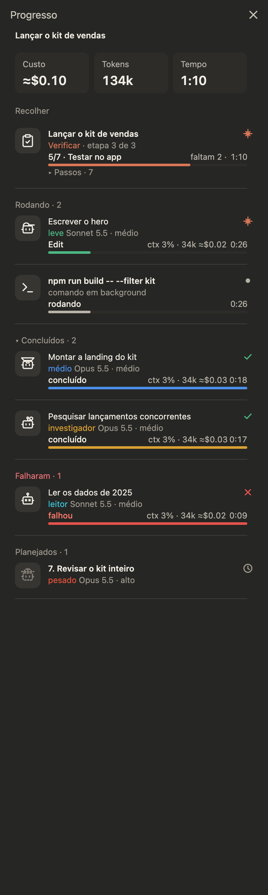
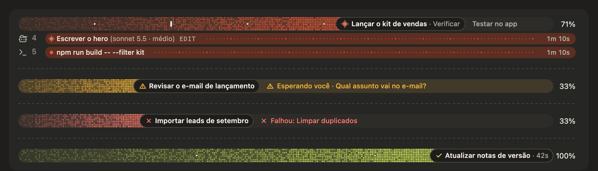
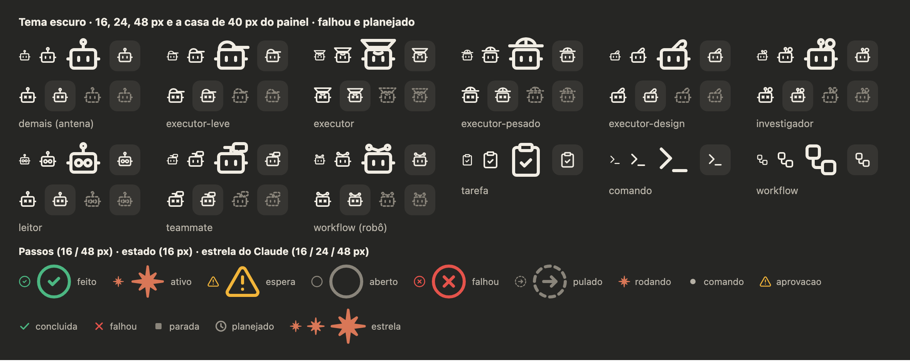

# claude-code-mods

Cinco mods para o Claude Code, escritos como plugins de function hooks. Desenham barras e faixas acima do prompt, avisam sobre cache e uso do plano, sobem um servidor de prévia para HTML e lembram o modelo de usar o seu design system.

Funcionam no terminal e na aba Code do app desktop. Textos e comandos estão em português.



## Pré-requisitos

- Claude Code recente, com suporte a function hooks.
- A variável `CLAUDE_CODE_ENABLE_FUNCTION_HOOKS=1` no bloco `env` do `~/.claude/settings.json`. Sem ela nenhum dos mods carrega.

```json
{
  "env": {
    "CLAUDE_CODE_ENABLE_FUNCTION_HOOKS": "1"
  }
}
```

Se o arquivo já tem um bloco `env`, acrescente só a linha da variável.

## Instalação

Num terminal com `claude` aberto, instale cada mod que quiser:

```
/plugin install progresso --marketplace Kelvi-Maycon/claude-code-mods
/plugin install barra-uso --marketplace Kelvi-Maycon/claude-code-mods
/plugin install cache-frio --marketplace Kelvi-Maycon/claude-code-mods
/plugin install previa --marketplace Kelvi-Maycon/claude-code-mods
/plugin install ds-primeiro --marketplace Kelvi-Maycon/claude-code-mods
```

Na primeira vez o Claude Code pergunta se quer adicionar o marketplace: responda `y`. Depois escolha o escopo do usuário (o primeiro da lista). O mod já roda na sessão atual e nas próximas.

Instalado no escopo do usuário pelo terminal, o mod carrega também na aba Code do app desktop. O comando `/plugin install` só existe no terminal.

## Mods

### progresso



Barras de progresso acima do prompt. O modelo recebe uma ferramenta (`progresso`) e uma regra curta no system prompt: em tarefa com vários passos, cria uma barra com o plano e a atualiza conforme avança. Cada barra mostra o passo ativo, a etapa, o percentual e o estado (andamento, esperando você, falhou, concluída).

- Subagentes e comandos Bash em background aparecem como faixas embaixo da barra, com tipo, modelo, esforço, ferramenta em uso, custo estimado e tempo.
- Painel lateral "Progresso" com custo, tokens, tempo, agentes rodando, concluídos, com falha e planejados. Clicar num agente abre a conversa dele, e dá para mandar mensagem a ele por ali.
- Som ao concluir, ao falhar e quando o modelo espera uma decisão sua.
- Se o turno vai terminar com uma barra aberta, o mod pede ao modelo que a feche antes (uma vez por barra).

Comandos:

- `/progresso`: mostra ou esconde as barras. Aceita `on`, `off` ou `painel` (abre o painel lateral).
- `/progresso-demo`: demonstração de 30 segundos com todos os estados, faixas, painel e sons.
- `/progresso-limpar`: remove todas as barras e faixas.

Ícones por tipo de agente: `executor-leve`, `executor`, `executor-pesado`, `executor-design`, `investigador` e `leitor` têm robôs próprios. `Explore` usa a lupa do investigador. `general-purpose`, `Plan`, `claude`, `fork` e qualquer outro nome usam o robô padrão, com o nome do tipo em cinza. Modelo e esforço vêm do frontmatter (`name`, `model`, `effort`) dos arquivos em `~/.claude/agents/`.

Um passo cujo título termina com o tipo do agente entre parênteses, como `Revisar tudo (executor-pesado)`, aparece no painel como agente planejado.



### barra-uso

Uma linha de pílulas acima do campo:

- `5H` e `7D`: uso do plano nas janelas de 5 horas e 7 dias, com o tempo até renovar.
- `CTX`: contexto usado até a compactação automática, pelo limite que o Claude Code informa (275k quando ele não informa nenhum).
- `CACHE`: tempo restante do cache de prompt (TTL de 60 minutos, fixo) e taxa de acerto.
- `DS on/off`: só aparece com o `ds-primeiro` configurado. Clicar alterna o DS nesta sessão.

Comando: `/uso`, com `on` ou `off`.

### cache-frio

Quando a sessão ficou parada além do TTL do cache e o contexto passa de 100k tokens, o próximo envio regrava o cache inteiro e custa mais. O mod segura esse envio uma vez, devolve o texto ao campo e avisa. Enviar de novo dentro de 3 minutos passa direto. Comandos de barra (`/compact`, `/clear`) nunca são segurados.

Comando: `/cache-frio` mostra contexto e tempo de cache. `/cache-frio ttl <minutos>` ajusta o TTL (padrão 60), `/cache-frio off` e `/cache-frio on` desligam e ligam o aviso.

### previa

Quando o modelo grava ou edita um `.html`, o mod sobe um `python3 -m http.server` na pasta do arquivo, a partir da porta 8765, e mostra a URL acima do prompt com botões para abrir, copiar e parar. O modelo recebe uma linha dizendo que o servidor já está no ar, para não abrir outro. Comandos Bash que matariam o servidor (`kill`, `pkill`, `killall` no processo dele) são negados.

Arquivos em `/tmp` e `/var/folders` não viram prévia.

Comando: `/previa <caminho>` serve uma pasta, `/previa status` lista os servidores, `/previa parar` encerra.

Requisitos: `python3` e `lsof` no PATH. O botão Abrir usa o comando `open` do macOS; em Linux ele não faz nada e o botão de copiar continua funcionando.

### ds-primeiro

No primeiro pedido de peça visual da sessão (página, landing, dashboard, slide, tela, componente...), anexa ao contexto uma linha pedindo que o modelo carregue a skill do seu design system antes de criar. Antes do envio aparece uma faixa avisando, com o botão "Tirar deste envio". A detecção é por verbos e alvos em português.

Não anexa quando o pedido já cita um design system, uma identidade visual, a sua skill, o rótulo ou um dos termos extras. Depois de compactar ou de `/clear`, volta a anexar no próximo pedido visual.

Sem configuração o mod não faz nada: não anexa, não mostra faixa e não registra comando. Para ligar, configure as opções do plugin. A tela de opções aparece na instalação, e depois fica em `/config`:

| Opção | O que é | Exemplo |
| --- | --- | --- |
| `skill` | Nome da skill do design system. Vazio desliga o mod. | `meu-design-system` |
| `rotulo` | Nome exibido na faixa, no toast e na linha anexada. Vazio usa o nome da skill. | `Minha Marca` |
| `ignorar` | Termos extras, separados por vírgula, que dispensam a linha quando citados. | `marca do cliente, sem ds` |

As opções ficam salvas no `~/.claude/settings.json`, em `pluginConfigs`.

Comando: `/ds` mostra o estado. `/ds on` e `/ds off` valem para a sessão; `/ds sempre on` e `/ds sempre off` mudam o padrão.

## Atualizar

```
claude plugin update <mod>@claude-code-mods
```

Depois, numa sessão aberta, rode `/reload-plugins`.

## Desinstalar

```
claude plugin uninstall <mod>@claude-code-mods
```

## Desenvolvimento

Cada plugin fica em `plugins/<nome>/`, com os hooks em `hooks/` e os testes em `tests/`.

```
claude plugin validate plugins/progresso
claude plugin test plugins/progresso
```

O `tsconfig.json` de cada plugin estende `.claude-plugin/types/tsconfig.json`, que o Claude Code gera no primeiro carregamento do plugin. Num clone novo o editor e o `tsc` acusam tipos ausentes até esse primeiro carregamento (ou um `claude plugin validate`). A pasta gerada fica fora do git.

Os sons do `progresso` são gerados por `plugins/progresso/sounds/gerar.py`.

## Créditos

A estrutura das barras do `progresso` foi portada do plan-progress (zycck/claude-mods), de Kirill Serditov, sob licença MIT. O texto da licença está em `plugins/progresso/licenses/plan-progress-LICENSE`.

## Licença

MIT. Veja [LICENSE](LICENSE).
